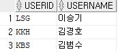

# Data Base

- 일련의 데이터들을 사용자가 이용할 수 있게끔 가공, 정제하는 과정, 비절차적 언어, 무결성 : 오염되지 않은 데이터들의 집합, 판단의 로직이 아니라 판단의 근거가 되는 데이터를 집어넣은 것

- 계획된 정보만을 꺼낼 수 있다는 단점을 가짐, 시간이 지남에 따라 정보의 요구도와 중요도가 바뀌어서 유동적인 정보에 취약함

- -변경하면 되지 않습니까? 변경하기가 힘들다. DB 자체에서는 프로세스를 할 수 없음 수정을하려면 전체를 다시 짜야하는 번거로움이 있음.
- 빅데이터와 DB는 상호보완적인 관계임
- 문제해결을 위해 필요한 데이터의 집합 
- 여러 책들에서 프로젝트의 요구사항들을 확인하면서 테이블의 구성을 공부해가면 좋음

## DBMS

- Data Base Management System


### History

- 계층형 (1960)
  - 1 : N의 관계, 최초 
- 망형 (1970)
  - N : M의 관계, 효과적이고 빠른 데이터 추출
- 관계형 (1980~90)
  - RDBMS, 테이블이라는 최소 단위 구성, 테이블은 하나 이상의 열로 구성됨 
- 객체지향형 
  - Object-DB, 사용빈도 낮음
- 객체관계형 (현재)
  - ORDB,  필요하다면 Object로 저장할 수 있음, 기본은 관계형으로 데이터가 저장됨

## Entity

- 클래스와 유사함.
- 여러 정보들과 관계를 가져야 함.
- 각 엔티티는 자신이 필요로 하는 데이터로 구성되어 있음.
- 메소드는 없다. 로직을 가지고 처리하는 것이 아니라 관계대수의 집합이론을 가지고 하기 때문에 절차가 없음.
- 작업 절차가 없음.
- 테이블 모양을 갖음. (schema와 record(instance, example)로 이루어짐)
- 파일 구조의 확장.

## SQL(Structured Query Language)

- 관계형 데이터베이스에서 사용되는 언어
- DBMS 제작회사와 독립적
- 다른 시스템으로 이식성 좋음
- 표준이 계속 발전 (기업간의 상호 합의)
- 대화식 언어 = 비 절차적 언어
- 분산형 클라이언트/서버 구조 = 데이터가 다른 기기에 존재함
  - 유/무선으로 연결할 때 상호 간의 프로토콜 
  - 서버와 클라이언트는 같은 회사에서 나오는 것이 기본
- 테이블에 저장된 데이터를 가지고 회사에서 요구하는 비즈니스 로직을 처리하기 위한 프로그램을 짜는 사람을 데이터베이스 개발자라고 한다.
- 비 절차적 언어이긴 하나, 간단한 함수가 들어감.
- Stored Procedure, Built-in Function이 필요함 = java에서 해결 가능 >> 데이터베이스 어플리케이션 개발자

query문을 직접 작성하는 것을 목표로 한다.

### CRUD

#### Create (생성, 데이터 삽입)

- 우리가 저장할 테이블을 만드는 것, 구조 잡기
- 구조 안에 구체적인 값을 집어 넣는 것, 인스턴스(레코드) 생성 하는 것
- 생성 코드

```sql
CREATE TABLE 식별자이름(
    
);
```

- 삽입 코드

```sql
INSERT INTO userTBL VALUES('~~','--');
```

위의 경우는 userTBL이 가진 열 순서 및 개수와 동일해야 한다.

```sql
INSERT INTO userTBL('~~','--') VALUES;
```

위의 코드를 통해 userTBL에 특정 정보만을 삽입할 수도 있다.

#### Read (조회)

- 조회할 때는 열 순서가 달라도 가능하다. 단, 바뀐 열 순서대로 출력된다.

- ```sql
  SELECT userID, userName
  FROM userTBL;
  ```

  

  ```sql
  SELECT *
  FROM userTBL;
  ```

  ``*``는 전체를 불러옴

- where절에는 연산자등을 이용해서 조건을 형성할 수 있다.

- 연속된 값의 경우 (BETWEEN AND)

  ```SQL
  SELECT userName, addr FROM userTBL WHERE height BETWEEN 180 AND 183;
  ```

  해석 : userTBL테이블에서 180~183 사이의 키를 가진 userName 과 addr를 조회

- 연속되지 않은 경우 (IN())

  ```sql
  SELECT userName, addr FROM userTBL WHERE addr IN('경남','전남','경북')
  ```

  해석 : userTBL테이블에서 경남, 전남, 경북의 주소를 가진 userName과 addr을 조회

- LIKE 연산자

  ```sql
  SELECT userName, height FROM userTBL WHERE userName LIKE '김%'
  ```

  해석 : userTBL 테이블에서 userName이 김으로 시작하는 모든 userName 과 height를 조회

  - % : 무엇이든 허용, 이외에도  ( _ )(underbar) : 한 글자(어떤 것이든 상관없음) 등이 있음

- 서브쿼리(SubQuery, 하위쿼리)

  ```sql
  SELECT userName, height FROM userTBL WHERE height > (SELECT height FROM userTBL WHERE userName = '김경호');
  ```

  where절의 조건을 SELECT문(서브쿼리)으로 특정지을 수 있다. 그러나 만약 SELECT문이 하나로 특정짓지 못하면 오류가 발생할 수 있다. 

  - 그런 경우에는 SELECT문(서브쿼리문) 앞에 

    ANY(서브쿼리의 여러 개의 결과 중 한 가지만 만족해도 됨)

    ALL(서브쿼리의 여러 개의 결과를 모두 만족)

    SOME(ANY와 동일한 의미)

    을 이용해서 처리해줄 수 있다.

- 조회 순서

  1.  데이터베이스에 접속
  2. sql 쿼리 작성 후 입력
  3. 출력을 받음
  4. 쿼리와 데이터베이스를 닫음
  5. 결과 처리

- ```java
  //접속
  public Connection getConnection(){
      Connection con = null;
      String driver = "oracle.jdbc.OracleDriver";
      String url = "jdbc:oracle:thin:@localhost:1521:xe";
      String id = "HR";
      String pwd = "1234";
      
      Class.forName(driver);
      con = DriverManager.getConnection(url,id,pwd);
      return con;
  }
  ```

- ```java
  //전체 조회
  public void readAll(){
      Connection con = this.getConnection();
      Statement stmt = con.createStatement();
      String sql = "SELECT * FROM userTBL3";
      System.out.println(sql);//출력확인
      ResultSet rs = stmt.executeQuery(sql);
      while(rs.next()){
          //결과를 받는 작업: 데이터를 인스턴스에 집어넣어서 리스트나 COLLECTION으로 변경
  		System.out.println(rs.getString("userID")+","
                     +rs.getString("userName")+rs.getInt("birthYear"));
      }
      rs.close();
      stmt.close();
      con.close();
  }
  //결과
  SELECT * FROM userTBL3
  LSG     ,이승기,1987
  KBS     ,김범수,1979
  KKH     ,김경호,1971
  JYP     ,조용필,1950
  LJB     ,임재범,1963
  EJW     ,은지원,1972
  JKW     ,조관우,1965
  BBK     ,바비킴,1973
  ```

- ```java
  //조건 조회
  public void readCondition (String data){
      Connection con = this.getConnection();
      String sql = "SELECT * FROM userTBL3 WHERE userID = ?";
      PreparedStatement stmt = con.preapareStatement(sql);
      stmt.setString(1,data);
      System.out.println(sql);
      ResultSet rs = stmt.executeQuery();
      while(rs.next()){
          System.out.println(rs.getString("userID")+","
                     +rs.getString("userName")+rs.getInt("birthYear"));
      }
      rs.close();
      stmt.close();
      con.close();
  }
  //결과
  SELECT * FROM userTBL3 WHERE userID = ?
  JYP     ,조용필,1950
  //기본키의 데이터 타입이 CHAR로 빈칸 까지 포함하지 않으면 원하는 결과값을 얻을 수 없었다.
  //따라서 VARCHAR로 데이터타입을 변경하거나 빈칸을 포함하여 파라메터를 설정해주어야 한다.
  ```

- 위의 모든 과정 중에 Exception을 하는 과정은 생략했다.

  - throws 이후 실행클래스에서 try /catch

- 쿼리를 데이터베이스에 입력하고 출력받는 코드는 동일 형태로 기억할 것!

#### Update (수정)

- 입력된 데이터를 본인이 원하는 데이터로 바꿈

```sql
UPDATE 테이블이름
	SET 열1 = 값1,  열2 = 값2
	WHERE 조건;
```

- WHERE절은 생략가능하지만 생략 시 테이블 전체의 행이 변경.

  현재의 단가가 1.5배 인상되었을 때

  ```sql
  UPDATE buyTBL SET price = price * 1.5;
  ```

#### Delete (삭제)

- 데이터의 삭제

  ```sql
  DELETE FROM 테이블 이름 WHERE 조건;
  ```

  where문 생략 시 전체 삭제.

#### ROLLBACK

- 앞에서 지우거나 변경한 사항들을 변경 전의 상황으로 되돌림
- 보통 교육용 코딩 프로그램은 자동 커밋이 진행되기 때문에 따로 커밋을 하지 않아도 됨
- 그러나 실무에서는 이를 수동으로 해놓는 경우가 있으니 주의

## SQL 문법

### 데이터 형식

- 숫자 데이터 형식

  ```sql
  CREATE TABLE userTBL(
  	birthYear NUMbER(4) NOT NULL
  );
  ```

  4자리까지의 숫자를 받는다

- 문자 데이터 형식

  ```sql
  CREATE TABLE userTBL(
      userID CHAR(8) primary key,
      userName NVARCHAR2(10) NOT NULL,
      addr NCHAR(100) NOT NULL
  );
  ```

  - CHAR : 고정길이 문자형, 숫자 없이 문자열만 
  
  - NCHAR : 유니코드 고정길이 문자형, 한글을 저장할 수 있다.(N : national, 유니코드 시)
  
  - VARCHAR : 가변길이형 문자열로 공간의 효율적 운용이 가능
  
  - CLOB : Character Long Object 대용량 텍스트의 데이터 타입(영문)
  
  - NCLOB : 유니코드 데이터 타입
  
  - BLOB : Binary LOB, 대용량 이진 데이터를 저장 가능(동영상, 음악파일)
  
  - DATE : 연,월,일,시,분,초가 저장됨
  
    - ```sql
      SELECT SYSDATE FROM DUAL ; -현재 날짜
      ```
  
  - TIMESTAMP : DATE와 같으나 밀리초 단위까지 저장

### 제약 조건

 : 데이터의 무결성을 지키기 위한 제한된 조건

무조건적으로 입력되는 것이 아닌 어떠한 조건을 만족했을 때 입력되도록 제약할 수 있음

- PRIMARY KEY : 기본키, NOT NULL + UNIQUE

```SQL
userID CHAR(8) PRIMARY KEY
```

- FOREIGN KEY : 두 테이블 사이의 관계를 선언함으로써, 데이터의 무결성을 보장해주는 역할

  관계설정 시 하나의 테이블이 다른 테이블에 의존하게 됨

  ```sql
  CREATE TABLE userTBL (
  	userID CHAR(8) NOT NULL PRIMARY KEY,
      --중략--
  );
  CREATE TABLE buyTBL(
  	userID CHAR(8) REFERENCES userTBL(userID),
      --중략--
  );
  ```

  ``REFERENCE`` 키워드를 이용하여 설정

  외래 키 테이블이 참조하는 기준 테이블의 열은 반드시 Primary key이거나, Unique 제약 조건이 설정되어 있어야 함.

- UNIQUE

  '중복되지 않는 유일한 값'을 입력해야 하는 조건, NULL값을 허용함.

- CHECK

  입력되는 데이터를 점검

  ```sql
  CHECK (height >= 0);
  ```

- DEFAULT

  값을 입력하지 않았을 때 자동으로 입력되는 기본 값을 정의

  테이블 설정 후 update 구문으로 사용

- NULL

  NULL값 허용

파일을 자바에 연결하고 자바에서 sql 쿼리를 만들어서 제공한다. 

default와 null의 구분은 확실히 할 것

 ### 테이블 수정

- ALTER TABLE 문

```sql
--열의 추가
ALTER TABLE userTBL
	ADD homepage VARCHAR(30)
		DEFAULT '' NULL;
--열의 삭제
ALTER TABLE userTBL
	DROP COLUMN homeAddr;
```

보통 수정할 경우는 없고, 삭제(DROP) 후 새로 만드는 방법이 주로 쓰임

### 뷰

- 보안에 도움되며, 복잡한 쿼리를 단순화
- 뷰의 실체는 SELECT문 뿐이며 그 안에 데이터가 없음
- 구체화된 뷰 : 실제 데이터가 존재하는 뷰

```sql
create or replace view v_userbuyTBL
as
select 
```


### 데이터 형 변환

- CAST함수

  ```sql
  CAST (expression AS 데이터 형식)
  SELECT CAST(AVG(amount) AS NUMBER(3)) AS "평균 구매 개수" FROM buyTBL;
  ```

- TO_CHAR(숫자, '형식')
- TO_NUMBER(문자,'형식')

### 조인

두 개 이상의 테이블을 서로 묶어서 하나의 결과 집합으로 만들어 내는 것

- INNER JOIN(내부 조인)

  ```sql
  SELECT <열 목록>
  FROM <첫 번째 테이블>
  	INNER JOIN <두 번째 테이블>
  	ON <조인될 조건>
  [WHERE 검색조건]
  ```

  일반적으로 INNER를 생략하여도 내부조인으로 인식

  ```sql
  SELECT *
  	FROM buyTBL
  		INNER JOIN userTBL
  		ON buyTBL.userID = userTBL.userID
      WHERE buyTBL.userID = 'JYP';
  ```

  JYP가 구매한 물건이 무엇인지 전부 알 수 있는 쿼리

  - 세 개 테이블의 조인

  ```sql
  SELECT S.stdName, S.addr, C.clubName, C.roomNo
  	FROM stdTBL S --AS가 생략된 형태 : 별칭
  		INNER JOIN stdclubTBL SC
  			ON S.stdName = SC.stdName
  		INNER JOIN clubTBL C
  			ON SC.clubName = C.clubName
      ORDER BY S.stdName;
  ```

  학생 테이블, 동아리 테이블, 학생동아리 테이블을 이용해서 학생을 기준으로 학생 이름/지역/가입한 동아리/동아리 이름을 출력하는 쿼리

- OUTER JOIN(외부 조인)

  ```sql
  SELECT <열 목록>
  FROM <첫 번째 테이블(LEFT테이블)>
  <LEFT | RIGHT | FULL> OUTER JOIN <두 번째 테이블(RIGHT 테이블)>
  	ON <조인될 조건>
  [WHERE 검색 조건];
  ```

  - LEFT OUTER JOIN

  ```sql
  SELECT U.userID, U.userName, B.prodName, U.addr, U.mobile1 || U.mobile2 As "연락처"
  	FROM userTBL U
  		LEFT OUTER JOIN buyTBL B
  			ON U.userID = B.userID
      ORDER BY U.userID;
   --왼쪽 테이블(userTBL)의 것은 모두 출력되어야 한다.
  ```
  
  - RIGHT OUTER JOIN
  
  ```sql
  SELECT U.userID, U.userName, B.prodName, U.addr, U.mobile1 || U.mobile2 As "연락처"
  	FROM buyTBL B
  		RIGHT OUTER JOIN userTBL U
  			ON U.userID = B.userID
      ORDER BY U.userID;
  ```
  
  - 구매 기록이 없는 명단 만드는 예제
  
  ```sql
  SELECT U.userID, U.userName, B.prodName, U.addr, U.mobile1 || U.mobile2 As "연락처"
  	FROM userTBL U
  		LEFT OUTER JOIN buyTBL B
  			ON U.userID = B.userID
      WHERE B.prodName IS NULL
      --이때, (=)이 아니라 IS를 써주어야 한다.
      ORDER BY U.userID;
  ```
  
  - NULL은 값이 주어지는 것이 아니라 값이 들어갈 수 있는 상태
  
  - FULL OUTER JOIN
  
    LEFT와 RIGHT가 합쳐진 것
  
  - SELF JOIN
  
    자기 자신과 자기 자신이 조인하는 의미
  
    ```sql
    SELECT A.emp AS "부하직원", B.emp AS "직속상관", B.department AS "직속상관부서"
    	FROM empTBL A
            INNER JOIN empTBL B
            	ON A.manager = B.emp
            WHERE A.emp = '우대리';
    ```
  
    하나의 테이블에 같은 데이터가 존재하되 의미는 다르게 존재하는 경우에는 두 테이블을 서로 SELF JOIN 시켜서 정보를 확인할 수 있다.
  
  ### SQL프로그래밍
  
  - CASE문
  
    ```sql
    CASE
    	WHEN (조건) THEN
    	(실행);
    	WHEN (조건) THEN
    	(실행);
    	ELSE
    	(실행);
    END CASE;
    ```
  
  ### 주석
  
  ```sql
  --주석입니다.
  ```

## DataBase Modeling

- 현 세계에서 사용되는 작업이나 사물들을 DBMS의 데이터베이스 개체로 옮기기 위한 과정
- 과거에 고도의 복잡한 업무절차(function의 비중이 커짐)로 인해 빈도가 줄어들었음
- 복잡한 절차는 데이터베이스가 감당하기 어렵고 이를 자바와 같은 프로그래밍 언어가 대신 하게 됨
- 개념적 모델링, 논리적 모델링, 물리적 모델링으로 나뉨