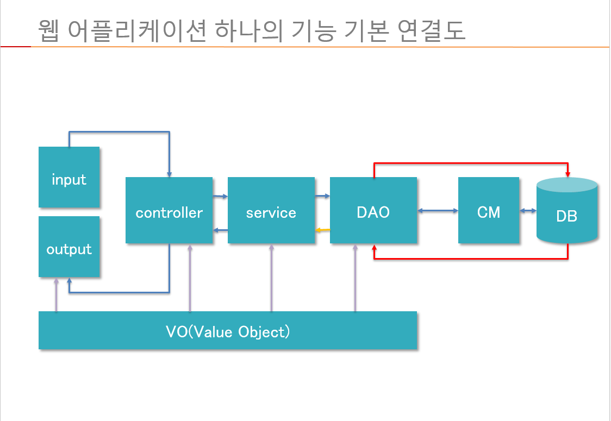
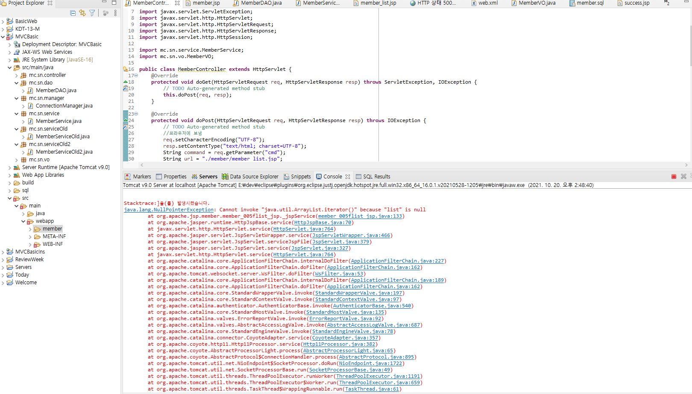

# Day21

## Servlet

- Servlet : 데이터를 처리하는 클래스
  1. url을 어떻게 결정할 것인가? 클래스를 어떻게 찾아갈 것인가?
  2. httpServlet 클래스가 데이터 처리 작업을 수행
  3. 상속받아서 오버라이딩을 통해 요청을 받을 때 수행함
- get, post방식으로 들어오는 것을 처리할 수 있음
- 클라이언트로부터 외부 정보를 받아오기 위해서는 스트림이 필요함
- 스트림 대신 get과 post의 매개변수(req, resp)를 이용해서 사용함

```java
//클래스 생성시 super클래스에서 HttpServlet을 추가해서 만든 클래스
public class MemberController extends HttpServlet {
	@Override
	protected void doGet(HttpServletRequest req, HttpServletResponse resp) throws ServletException, IOException {
		// TODO Auto-generated method stub
		this.doPost(req, resp);
	}
	//doGet과 doPost를 ctrl+space해서 쉽게 만들 수 있다.
	@Override
	protected void doPost(HttpServletRequest req, HttpServletResponse resp) throws ServletException, IOException {
		// TODO Auto-generated method stub
		//브라우저에 보냄
		resp.setContentType("text/html; charset=UTF-8");
		PrintWriter out = resp.getWriter();
         out.print("Hello");
	}
}
```

- VM(virtual machine)은 컨테이너(application server)와 같다.
- I,O에 관련된 두 통로를 모두 알고 있음

### 생명주기

- 로딩 이후에는 더 이상 개발자는 관리하지 않으며, 삭제할 때까지 컨테이너가 이를 책임짐. 컨테이너가 인스턴스를 컨트롤할 때 서블릿의 생명주기에 관련된 메소드를 가지고 관리한다. 관리에 주 목적이 있음
- 로딩 시 이루어지는 과정

1. 초기화
   - init(), 자동으로 DB에 연결하게 됨, 생성자와 동일하지는 않지만 역할은 동일.
   - Connection을 맺은 상태로 계속할 수 없기 때문에 init에서 Connection이 이루어지지 않는다.
2. 작업 수행(서비스)
   - doGet(), doPost() :  요청에 따라 골라 쓰임
3. 종료
   - destroy(), 서버에 접속된 Connection을 제거 함.

- 차례대로 호출 됨, 순서가 어긋나 에러가 일어나지 않음, init과 destroy는 단 한 번만 호출됨

### Web.xml

- 하나의 어플리케이션에 관련된 데이터 환경 정보 설정이 이 xml에 들어감

- extensible markup language

- 서블릿의 등록 정보

- 서비스를 하는 전체적인 내용, 필요한 환경설정 정보, 태그의 집합

- 사용자가 서비스(주소)만 적고 따로 정보가 입력되지 않을 시 자동으로 불러오는 파일

  ```xml
  <welcome-file-list>
      <welcome-file>index.html</welcome-file>
      <welcome-file>index.htm</welcome-file>
      <welcome-file>index.jsp</welcome-file>
      <welcome-file>default.html</welcome-file>
      <welcome-file>default.htm</welcome-file>
      <welcome-file>default.jsp</welcome-file>
    </welcome-file-list>
  ```

- 자바 웹 어플리케이션의 정보를 web.xml에서 일단 다 로딩함

- 작성

  ```xml
  <servlet>
    	<servlet-name>controller</servlet-name>
    	<servlet-class>mc.sn.controller.MemberController</servlet-class>
    </servlet>
    <servlet-mapping>
    	<servlet-name>controller</servlet-name>
    	<!-- url을 지정해서 적어 놓는 과정 -->
    	<url-pattern>/CmdController</url-pattern>
    </servlet-mapping>
  ```

- DOM 방식과 SAX 방식
- 태그의 역할
  - HTML에서는 정보의 구조와 이미지를 책임지고 있다.
  - 데이터를 명시하는 역할
  - 원하는 데이터를 가져가기 위해서는 태그를 사용함 따라서 태그의 설계가 중요함
  - xmlDB가 만들어지긴 하였으나 너무나 방대한 양의 태그로 인해 더 이상 쓰이지 않음
- 관리가 어렵고 다수의 에러 발생으로 최근에는 사용이 줄어드는 추세
- instance를 만들어서 관리하는 것은 컨테이너가 함

# Day22

- Servlet : Controller

  자기 책임성의 원칙에 따라 하는 일을 분리했다.

1. Server
2. Business
3. DAO(Data Access Object)
4. Connection

- VO(Value Object) = DTO(Data Transfer Object) = DataBean

1. VIEW Client(html)
   1. in
   2. out
2. SERVER Controller WAS(java)
   1. Servlet
      1. Business
      2. DB(crud)
      3. Connection
3. MODEL DB(sql)
4. VO(Value Object)

- 하나의 서블릿에 여러 개의 작업을 처리하기 위해서 작업처리 cmd를 QueryString 방법을 이용하여 전ㄷ라함

  ```java
  http:/localhost:9090/BasicWeb/member/CmdController?key=value
  ```

- list의 경우 다른 페이지에 접근하는 것이 아니라 url을 통해 바로 접근했음

## QueryString

- MVC방식 이전에 Model2라 불림
- Servlet의 유무에 따라 Model1과 Model2로 나뉨
- CmdController라는 서블릿을 중복해서 처리할 수는 없기 때문에
- get방식으로 보내는 것을 QueryString이라고 한다.
- url을 ``CmdController?key=value``의 형태
- 의사표시가 가능 : 작업지시 커맨드를 보내는 것
- 하나의 서블릿에 여러 개의 지시가 가능하게 됨

# Day23

- 애자일 방법론

- 삭제 작업

- DAO와 Service의 차이
  - 자바에서 실질적으로 비즈니스 로직을 사용하기 위해 필요한 데이터는 데이터베이스에서 DAO를 통해 가져오게 됨
  - 복잡한 데이터 처리의 경우 Service에서 감당한다
- RequsetDispatcher 
  - 두 세 페이지인 경우에 사용함
- Session
  - 여러 페이지를 오랜 시간동안 사용할 때 사용함
- ConnectionPool
  - 대여와 반납의 개념

# Day24

- forward방식과 sendRedirect방식
  - 현재 위치와 시작위치의 차이
  - forward는 데이터도 같이 보내지만 sendRedirect는 이동만 데이터는 session이
- RequestDispatcher와 Session(자바 웹을 다루는 기술 12장 440p참고)
  - 한 번 쓰고 말 것이라면 RequestDispatcher가 훨씬 경제적
  - 여러 페이지를 연결시켜줌
  - 처음의 페이지를 이후 두 세 페이지까지 연결함
  - 웹 사이의 데이터를 공유하기 위한 방법
  - session은 일정 시간을 두고 그 시간안에 이루어진 모든 작업들을 저장함
  - 기간은 로그인 부터 로그 아웃까지

# Day25

- JSTL(Java Standard Tag Library)

  ```jsp
  <c:choose>
  <!-- jstl-->
  </c:choose>
  ```
  view, node.js등에서 활용됨

  ```jsp
  <c:choose>
      <c:when test="${ empty membersList}" >
        <tr>
          <td colspan="5" align="center">
            <b>등록된 회원이 없습니다.</b>
         </td>  
        </tr>
     </c:when>  
     <c:when test="${!empty membersList}" >
        <c:forEach  var="mem" items="${membersList }" >
        <!-- for(MemberVO mem : memberList) -->
          <tr align="center">
            <td>${mem.id }</td>
            <td>${mem.pwd }</td>
            <td>${mem.name}</td>     
            <td>${mem.email }</td>     
            <td>${mem.joinDate}</td>     
         </tr>
       </c:forEach>
  </c:when>
  </c:choose>
  ```

# Day 26

- 바인딩(맵 방식key:value)

  - 서블릿에서 다른 서블릿 또는 JSP로 대량의 데이터를 공유하거나 전달하고 싶을 때

  - Get방식으로 데이터를 전달할 수 있으나 대량의 상품 정보를 보내게 되는 경우 보안 문제로 인해 불편함이 생김

  - redirect 방식

    첫 번째 서블릿

    ```java
    @WebServlet("/first")
    request.setAttribute("address", "서울시 성북구");
    //웹 브라우저에서 요청한 request객체에 address의 값으로 "서울시 성북구"를 바인딩
    response.sendRedirect("second");
    //두 번째 서블릿으로 전달하기 위해 sendRedirect()를 호출
    ```

    두 번째 서블릿

    ```java
    @WebServlet("/second")
    String address =(String)request.getAttribute("address");
    //전달된 request에서 getAttribute()를 이용해 address를 가져옴
    결과 :  null 출력
    ```

    redirect방식으로는 서블릿에서 바인딩한 데이터를 다른 서블릿으로 전송할 수 없음

  - disptch포워딩

    첫 번째 서블릿

    ```java
    @WebServlet("/first")
    request.setAttribute("address", "서울시 성북구");
    //웹 브라우저에서 요청한 request객체에 address의 값으로 "서울시 성북구"를 바인딩
    ResquestDispatcher dispatch = request.getRequestDistpatcher("second");
    dispatch.forward(request, response);
    //바인딩된 request를 다시 두 번째 서블릿으로 포워드
    ```

    두 번째 서블릿

    ```java
    @WebServlet("/second")
    String address =(String)request.getAttribute("address");
    //전달된 request에서 getAttribute()를 이용해 address를 가져옴
    결과 :  '서울시 성북구' 출력
    ```

    첫 번째 서블릿에서 두 번째 서블릿으로 전달되는 request가 브라우저를 거치지 않고 바로 전달되었다. 따라서 첫 번째 서블릿의 request에 바인딩된 데이터가 그대로 전달됨

  - ServletContext

    - 서블릿의 실행환경에 대한 정보

# 기본 사항

1. MVC프로젝트를 생성할 수 있어야 한다.

2. 프로젝트 환경설정을 할 수 있어야 한다.(web.xml server.xml)

3. 클라이언트 소스 및 파일의 위치를 결정하고 접근할 수 있어야 한다.

4. 리소스 파일(이미지, css, JS, XML, 기타), 자바 코드, JSP/HTML 코드를 구분하여 저장할 수 있어야 한다.

5. MVC구조를 이용하여 Login을 실행하고 결과를 출력한다. --> 과제 내용

   - 페이지 이동 방식

   - ajax 이동 방식

6. MVC에 관련된 3군데의 네트워크를 연결하는 방법을 알고 있어야 한다.

   - 페이지 연결
   - 자바클래스 연결
   - 데이터베이스 연결

7. 요청/응답 처리, 비즈니스 로직처리, 데이터베이스 연결처리를 할 수 있어야 한다.

8. 위의 모든 것은 클라이언트의 요구사항에 대응해야 한다.

# MVC 정리



- 페이지의 연결은 어떻게 할 것인가?
  - 요청 : 1. 주소 2. ``<a>``태그 3. form태그  : url을 어떻게 보낼 것인가?
  - 응답 : sendRedirect, forward = url을 어떻게  보낼 것인가?
- 컨트롤러에 작업요청은 어떻게 할 것인가? = URL
  - 작업의 종류를 보낸다 : QueryString, 다르게 식별되는 페이지명
- 작업처리 결과(데이터)를 어떻게 클라이언트에게 전달할 것인가?
  - 요청 객체 또는 세션 객체 또는 어플리케이션 객체에 저장해서
- 컨트롤러, 서비스, DAO는 어떻게 구별하는가?
  - 컨트롤러 : 클라이언트로부터의 요청과 데이터를 받고 처리 결과를 전송
  - 서비스 : 컨트롤러에게 받은 데이터와 DAO에게서 받은 데이터를 가지고 비지니스 로직처리하여 컨트롤러에게 결과를 전달
  - DAO : 데이터베이스에 연결하여 필요한 데이터를 가져와서 컨트롤러에게 전달
- 데이터클래스의 용법은 무엇인가?
  - 서로 관련있는 데이터를 하나로 묶는 역할
  - 각 단계로 한 세트의 데이터를 묶어서 전달
- 클라이언트의 역할에서 INPUT과 OUTPUT의 차이점은 무엇인가?
  - INPUT : 작업지시의 시작
  - OUTPUT : 작업지시의 결과(또 다른 작업지시의 시작이 될 수 있음)
- 서버로 이동 없이 데이터 처리 (서버사이드작업)를 할 수 없을까?
  - 자바스크립트의 XMLHttpRequest객체를 통해서 Ajax 라이브러리 사용(jQuery)
- 클라이언트에서 데이터를 수집하는 방법은 어떤 것이 있는가?
  - Form데이터 또는 QueryString
- DB에 CRUD쿼리를 어떻게 전달하고 결과를 받을 수 있는가?
  - JDBC를 통해서
  - Connection - Statement - ResultSet

## jQuery

- Ajax(Asynchronous Javascript + XML) 자바 웹을 다루는 기술 16장 638p

  - 페이지의 이동 없이 데이터 처리가 가능
  - 클라이언트와 서버 간의  XML이나 JSON 데이터를 주고 받는 기술
  - ID중복 여부 확인
  - Ajax의 기본 형태

  ```javascript
  $.ajax({
      type: "post"또는 "get",//데이터 형식
      async:"true" or "false"
      url : "요청할 url",
      data : {서버로 전송할 데이터},//key&value방식,맵방식
      datatype: "서버에서 전송받을 데이터 형식",
      success:function(){
      //정상 요청, 응답 시 처리
  	}
  	error : function(){//오류 발생 시 처리}
      complete : function(){//작업 완료후 처리} 
  });
  ```

  - 페이지를 변경할 때 쓰는 메소드

    ```java
    window.location.assign();
    //window.location.href();>>원래 알고 있던 형태는 이것이었으나, Ajax에서는 먹히지 않음
    ```

    


# Error

- 

리소스를 찾을 수 없다는 에러, 이름이 잘못되었거나 철자가 틀린경우 자주 발생


- 

서블릿에서는 저장 후에 서버에 re-load하는 과정을 거침

- 

 Query String 오류, 먼저 리퀘스트를 받고 리스폰스를 하는 과정이 들어가야 하는것이지 곧바로 결과를 도출하려다 나오는 에러, 브라우저에 http://localhost:9090/MVCBasic/CmdController?cmd=list를 통해 멤버 리스트를 호출하는 것!

- [tomcat](http://tomcat.apache.org/tomcat-9.0-doc/jndi-resources-howto.html)
- 

클래스패스에 서블릿 에러  프로젝트의 설정에 들어가서 Java Build Path의 Libraries에서 Add Library... 클릭 Web App Libraries추가 혹은 Server Runtime 추가 그리고 에러난 servlet-api.jar을 Remove

- 

이미 Primary Key를 중복 사용 시 나오는 무결성 에러